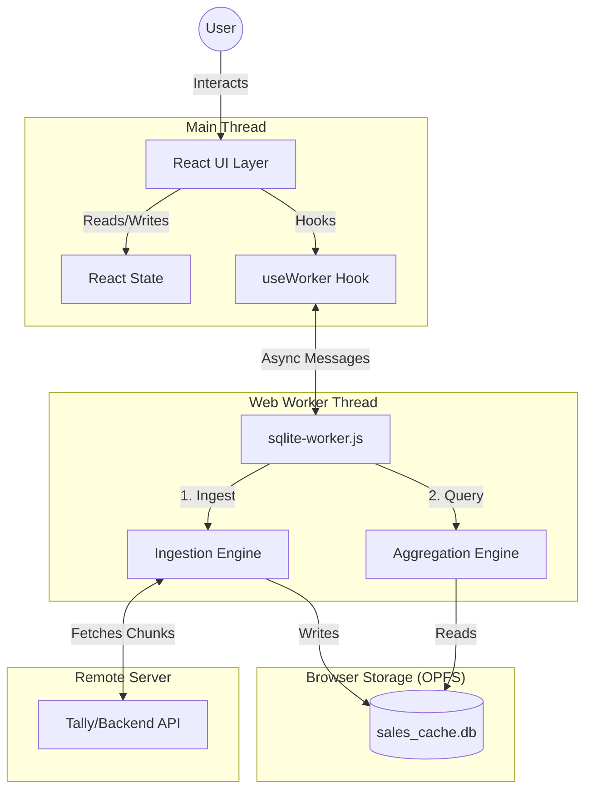
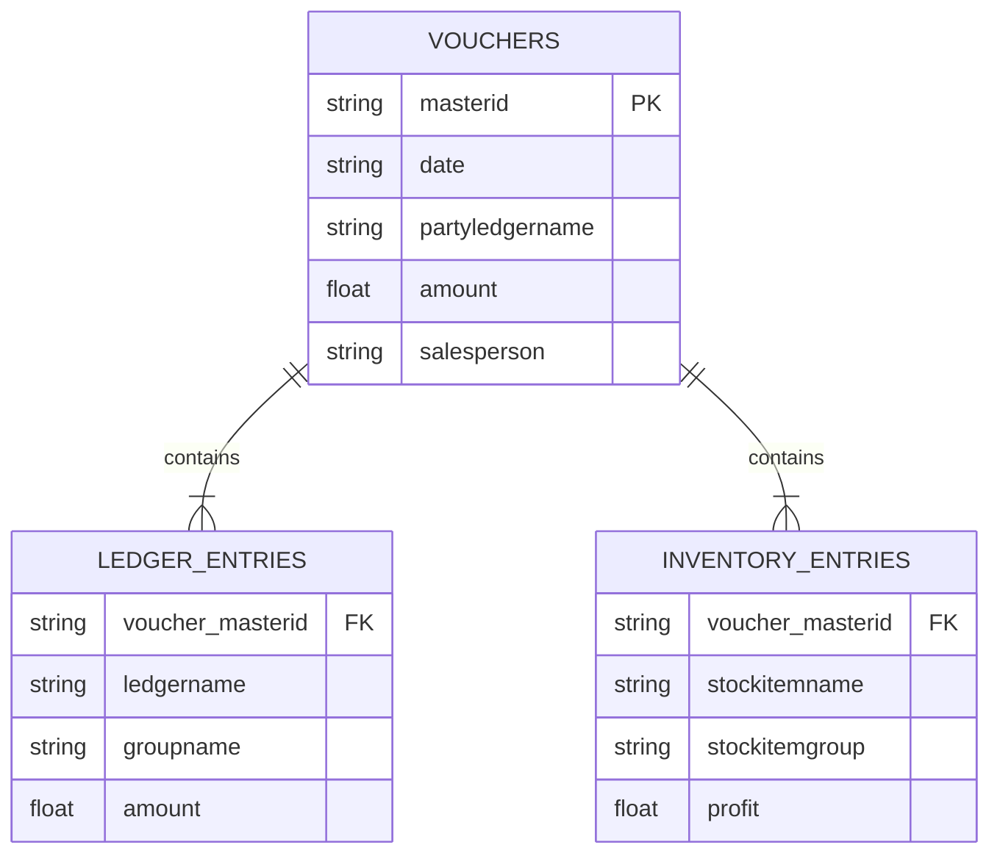

# Sales Dashboard Architecture & Technical Specification

## 1. System Overview

The Sales Dashboard is a high-performance, **Offline-First** Single Page Application (SPA) built to visualize large datasets (Financial & Inventory records) directly in the browser. It bypasses traditional backend-heavy reporting by leveraging **WebAssembly (SQLite WASM)** and the **Origin Private File System (OPFS)**.

### High-Level Architecture

---

## 2. Database Schema (SQLite)

The architecture relies on a specialized star-schema variant optimized for read-heavy analytical queries.

### 2.1 Tables

#### `vouchers` (Fact Table)
Stores the core transaction header data.
- **PK**: `masterid`, `guid`
- **Columns**:
  - `date` (YYYYMMDD) - *Indexed*
  - `vouchertype`, `vouchernumber`
  - `partyledgername` (Customer Name) - *Indexed*
  - `amount` (Total Bill Value)
  - `salesperson` (Derived or Explicit)
  - `iscancelled`, `isoptional`
  - `state`, `country` (Geo analysis)

#### `ledger_entries` (Dimension/Fact)
Stores accounting details (Generals, Taxes, etc.).
- **FK**: `voucher_masterid` -> `vouchers.masterid`
- **Columns**: `ledgername`, `groupname` (Aggr Key), `amount`, `ispartyledger`.
- **Purpose**: Analyzing sales by Ledger Group or specific Tax heads.

#### `inventory_entries` (Dimension/Fact)
Stores semantic item details.
- **FK**: `voucher_masterid` -> `vouchers.masterid`
- **Columns**:
  - `stockitemname`, `stockitemgroup` - *Indexed*
  - `actualqty`, `billedqty`, `rate`, `amount`
  - `profit`, `grosscost`
- **Purpose**: Item-level profit analysis, Top Selling Items.

#### `sync_meta` (System)
Key-value store for synchronization cursors.
- `last_sync_time`: ISO Timestamp
- `last_sync_from`: Date string (YYYYMMDD)
- `last_sync_to`: Date string (YYYYMMDD)

### 2.2 Entity Relationship Diagram

---

## 3. Data Pipeline & Ingestion Strategy

To handle millions of records without freezing the UI, the system employs a **Chunked Transactional Pipeline**.

### 3.1 Ingestion Flow (`handleDownload` / `handleUpdate`)
1.  **Date Chunking**: The requested date range (e.g., 3 years) is split into manageable chunks (e.g., 1 day or 1 week) using `chunkDates()`.
2.  **Sequential Fetching**: Chunks are fetched sequentially from the API to avoid server timeouts and browser memory pressure.
3.  **Transactional Write**:
    - `BEGIN TRANSACTION`
    - **Salesperson Derivation**: If `salesperson` is missing, logic checks `ledgerentries` for the Party Ledger's parent group.
    - **Batch Insert**: Uses Prepared Statements (`db.prepare`) to insert Vouchers, Ledger Entries, and Inventory Entries.
    - `COMMIT`
4.  **Progress Reporting**: The worker emits `progress` events (current/total) to the UI after each chunk.

### 3.2 Optimization Techniques
- **Prepared Statements**: Parsed once, executed thousands of times.
- **Deduplication**: `INSERT OR REPLACE` ensures idempotency if a sync is restarted.
- **Cleanup**: `DELETE FROM ...` runs before insertion for specific voucher IDs to prevent ghost records during updates.

---

## 4. Query & Aggregation Engine

The dashboard does **not** simply run `SELECT *`. It features a dynamic query building engine.

### 4.1 The Temporary Table Strategy (`getDashboardData`)
To maximize performance for complex filtered views, the system uses a **Materialized View** pattern via SQLite Temporary Tables.

1.  **Step 1: Build Filters**:
    - Converts UI filters (Date Range, Salesperson, State) into SQL `WHERE` clauses.
2.  **Step 2: Materialize `_fv`**:
    - `CREATE TEMP TABLE _fv AS SELECT ... FROM vouchers WHERE ...`
    - This creates a small, in-memory subset of the data relevant to the current view.
3.  **Step 3: Execution**:
    - All subsequent charts (KPIs, Trends, Top Items) run against `_fv` (the small subset) instead of the massive `vouchers` table.
    - **KPI Precision**: If Item/Group filters are active, KPIs switch from summing `vouchers.amount` to summing `inventory_entries.amount` to ensure mathematical accuracy.

### 4.2 Dynamic Card Engine (`computeCardData`)
The system supports "Custom Cards" defined by JSON configuration.
- **Resolver**: Maps abstract concepts like `groupBy: "month"` to SQL `SUBSTR(date, 1, 6)`.
- **Pivot Logic**: For Stacked Bar Charts (`segmentBy`), the worker:
    1.  Queries top segments (e.g., Top 5 Item Groups).
    2.  Pivots the flat SQL result set into a nested JSON structure (`{ name: 'Jan', GroupA: 100, GroupB: 200 }`) for Recharts.

---

## 5. Synchronization Protocol

The `useWorker` hook acts as the state machine manager.

### Message Protocol
- **`get_dashboard_data`**:
    - **Input**: `{ guid, fromDate, toDate, filters }`
    - **Output**: `{ kpi, charts, extended }`
- **`get_custom_cards_data`**:
    - **Input**: `{ guid, cards: [], filters }`
    - **Output**: `[ { cardId, data: [] } ]`
- **`download` / `update`**:
    - **Input**: `{ company, token, dateRange }`
    - **Output**: stream of `progress` events -> `download_complete`

### Concurrency Handling
- The Worker processes messages strictly sequentially (FIFO).
- The UI "debounces" progress updates (100ms) to prevent React render thrashing during high-speed syncs.
